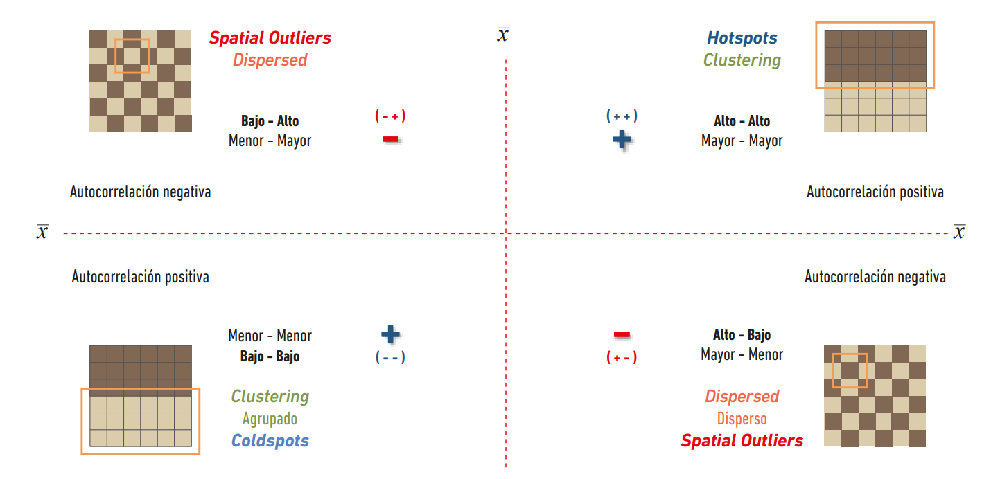

```{r setup, include=FALSE}
knitr::opts_chunk$set(fig.align = "center", fig.pos = "H", warning = F)
library(kableExtra)
library(knitr)
library(sf)
library(tidyverse)
library(spdep)
library(rgdal)
library(RColorBrewer)
library(boot)
library(spatialreg )
library(lmtest)
library(sandwich)
library(mgcv)
```

# Modelación de datos en áreas

## Introducción

Los datos espaciales suelen observarse en entidades poligonales con límites definidos. Los límites de los polígonos son definidos por el investigador, en algunos campos de estudio pueden ser arbitrarios en otros y pueden ser límites administrativos creados con fines muy diferentes en otros. Los datos observados suelen ser agregaciones dentro de los límites, como los recuentos de población. Las entidades territoriales pueden constituir en sí mismas las unidades de observación, por ejemplo cuando se estudia el comportamiento de los gobiernos locales donde las decisiones se toman a nivel de la entidad, por ejemplo, la fijación de los tipos impuestos locales. Sin embargo, en general, las entidades de área son agregados, recipientes, que se utilizan para contabilizar las mediciones, como los resultados de las votaciones en los colegios electorales. Muy a menudo, las entidades de área son una teselación exhaustiva del área de estudio, sin dejar ninguna parte del área total sin asignar a una entidad. Por supuesto, las entidades de área pueden estar formadas por múltiples entidades geométricas, como islas pertenecientes a un mismo condado; también pueden rodear completamente a otras entidades de área por completo, y pueden contener agujeros, como los lagos.

Los límites de las entidades de área pueden definirse con algún otro propósito que su uso en el análisis de datos. Las zonas de código postal pueden ser útiles para el análisis, pero se crearon para facilitar los envíos postales. Sólo recientemente las organizaciones censales nacionales han aceptado que los cambios frecuentes, aparentemente justificados de los límites son un problema importante para los análisis longitudinales. Los límites arbitrarios de las unidades de área son un problema si su modificación puede conducir a resultados diferentes, y el caso del gerrymandering político es un recordatorio aleccionador de cómo los cambios en la agregación pueden cambiar los resultados. También pueden obstaculizar el análisis si la escala espacial o la huella de un proceso de generación de datos subyacente no se corresponde con los límites elegidos.

Si la recopilación de datos puede diseñarse para que las entidades de área coincidan con los datos, se reducirá la influencia de la elección de los agregados. Un ejemplo podría ser la correspondencia de los datos del mercado laboral con los mercados laborales locales, tal vez definidos por los desplazamientos al trabajo. Por otro lado, si nos vemos obligados a utilizar límites arbitrarios, a menudo porque no hay otras fuentes de datos secundarios, debemos ser conscientes de las posibles dificultades. Estos desajustes se encuentran entre las razones para encontrar autocorrelación espacial en el análisis de los agregados de área; otras razones son los procesos espaciales sustanciales en los que las entidades se influyen entre sí por contagio, como la adopción de políticas similares por parte de los vecinos, y la especificación errónea del modelo que deja información con patrones espaciales en los residuos del modelo. Estas causas de la autocorrelación espacial observada pueden de la autocorrelación espacial observada, por lo que la identificación correcta de los procesos espaciales reales es una tarea interesante.

Un amplio rango de disciplinas científicas se ha encontrado con la autocorrelación espacial entre entidades de área, con el término “problema de Galton” utilizado en varias. El problema consiste en establecer cuántas observaciones efectivamente independientes están presentes cuando se han utilizado límites arbitrarios para dividir un área de estudio. En su intercambio con Tyler en 1889, Galton cuestionó si las observaciones de las leyes matrimoniales a través de entidades areales constituían observaciones independientes, ya que sólo podían reflejar un patrón general del todos descienden. Así, la dependencia espacial positiva tiende a reducir la cantidad de información contenida en las observaciones, porque las observaciones próximas pueden utilizarse
en parte para predecirse mutuamente.

hemos visto cómo las distancias en una superficie continua pueden utilizarse para estructurar la autocorrelación espacial, por ejemplo con el variograma. Aquí nos ocuparemos de las entidades de área que se definen como vecinos. En una superficie continua, todos los puntos son vecinos de los demás, aunque algunos pueden tener muy poco peso, porque están muy distantes. En una superficie teselada, podemos elegir definiciones de vecinos que dividen el conjunto de todas las entidades (excluyendo la observación i) en miembros o no miembros del conjunto de vecinos de la observación i. También podemos decidir dar a cada relación de vecindad un peso igual, o variar los pesos en los arcos del grafo dirigido que describe la dependencia espacial.

En la siguiente sección se tratará la construcción de los vecinos y los pesos que pueden aplicarse a las vecindades. Una vez establecido este importante y a menudo exigente prerrequisito, pasamos a estudiar las formas de medir la autocorrelación espacial. Aunque las pruebas se basan en modelos de procesos espaciales, primero examinamos pruebas, y después pasamos a la modelización. También nos interesa mostrar cómo se puede introducir la autocorrelación espacial en datos datos independientes, para poder realizar simulaciones. Hay que tener en cuenta que el patrón espacial que encontremos puede indicar únicamente que nuestro modelo actual de los datos no es adecuado. Esto se aplica a las unidades de área que no se ajustan al proceso de de generación de datos, a las variables que faltan, incluidas las que tienen una forma forma funcional incorrecta, y a las diferencias entre nuestras suposiciones sobre los datos y sus distribuciones reales, que a menudo se muestran como una dispersión excesiva en los datos de recuento.

### Dataset

Se utilizará los datos de censo para 8 condados centrales del estado de New York

```{r message=FALSE, warning=FALSE}
NY8 <- readOGR("data", "NY8_utm18")
ny <- st_read("data/NY8_utm18.shp")
plot(st_geometry(ny), axes = T)
```

# Vecinos y pesos espaciales

La creación de pesos espaciales es un paso necesario en el análisis de datos en área. El primer paso es definir cuales relaciones entre las observaciones tendrán pesos no nulos, es decir, escoger el criterio para que dos enlaces sean considerados como "vecinos"; el segundo es asignar los pesos a los enlaces identificados como "vecinos" en el paso anterior.

Crear los vecinos y pesos no es un proceso fácil y por lo tanto existen varias funciones y métodos en el paquete `spdep` que ayudan a realizar este trabajo. El paquete `ade4` contiene las funciones `nb2neig()` y `neig2nb()` las cuales ayudan a transformar objetos entre las clases `nb` y `neig`.

## Objetos vecinos

En el paquete `spdep` las observaciones enlazadas (vecinas) son objetos de clase `nb`; dichos objetos pueden ser vistos como una lista de tamaño $n$ donde cada elemento contiene un vector con los indices de sus correspondientes vecinos. Si alguna observación no tiene vecinos, la entrada correspondiente contiene el valor cero (0). Estos objetos también contiene otro tipo de atributos como lo puede ser un vector de caracteres para identificar cada una de las regiones consideradas, además de un vector lógico (booleano) que indica si una relación es simétrica o no (se discute más adelante). La función `card()` devuelve el número de vecinos para cada elemento de la lista (objeto `nb`). A continuación se presenta brevemente la estructura de estos objetos espaciales:

```{r message=FALSE, warning=FALSE}
NY_nb <- read.gal("data/NY_nb.gal", # read.gal carga el archivo de clase nb
  region.id = as.numeric(row.names(ny)) - 1
) # Debe empezar en 0
summary(NY_nb)

plot(st_geometry(ny), border = "grey60", axes = T)
plot(NY_nb, st_geometry(ny), pch = 19, cex = 0.6, add = T)
```

Un archivo `gal` es una matriz de pesos o vecinos producida por el software GeoDa. Para esta situación particular, todas las regiones contiguas son consideradas como regiones vecinas.

Luego de ilustrar los datos espaciales que van a ser tratados, se usará un subconjunto de ellos para mostrar el uso de las principales funciones y métodos para los objetos `nb`; el subconjunto a usar corresponde a Syracuse city.

```{r}
Syracuse <- filter(ny, AREANAME == "Syracuse city")
Sy0_nb <- subset(NY_nb, ny$AREANAME == "Syracuse city")

plot(st_geometry(Syracuse), border = "grey60", axes = T)
plot(Sy0_nb, st_geometry(Syracuse), pch = 19, cex = 0.6, add = T)
```

Los principales métodos de los objetos `nb` son `print()`, `summary()` y `plot()`, sin embargo, no son los únicos que existen.

Tanto `print` como `summary` presentan el número de regiones, enlaces no nulos, porcentaje de pesos no nulos y promedio de enlaces entre regiones, sin embargo, `summary` presenta adicionalmente la distribución del número de enlaces del objeto `nb`, además de las regiones con menor y mayor frecuencia de enlaces dentro del objeto.

```{r}
summary(Sy0_nb)
```

Adicionalmente, el método `summary` también reporta la presencia o no de asimetría en el objeto `nb`

> La asimetria está presente cuando *i* es un vecino de *j*, pero *j* no es un vecino de *i*.

:::{style='text-align: justify'}
El resultados del método `summary` brinda la siguiente información:

-   El número de regiones (polígonos) en la base de datos: 63
-   El número de relaciones diferentes de 0: 346\
-   El porcentaje de pesos distinto de 0: 8.717561
-   El número promedio de relaciones entre los polígonos: 5.492063

Se observa también la distribución de las relaciones que indican que el número máximo de vecinos que se encontraron fueron 9 y estuvieron con respecto a un poligono, 17 de las 63 regiones presentes tienen 6 uniones, etc.
:::

La función `card` permite obtener de forma rápida el número de vecinos de cada región.

```{r}
card(Sy0_nb)
```

:::{style='text-align: justify'}
Se crearán objetos de lista de vecinos para uso posterior en el documento, para esto se utiliza la función `knearneigh` para obtener el índice de los puntos de $k$ vecinos cercanos, esta función recibe como parametro de ingreso la lista de coordenadas de los puntos y un valor $k$ que indica el número de puntos vecinos cercanos que se desean retornar. El resultado de la operación anterior se ingresa a la función `knn2nb` para convertir el objeto resultante en una lista de vecinos de la clase `nb`.
:::

```{r}
coords <- st_point_on_surface(st_geometry(Syracuse))
ids <- row.names(Syracuse)
Sy8_nb <- knn2nb(knearneigh(coords, k = 1), row.names = ids)
Sy8_nb
```

::: {style="text-align: justify"}
la función `nbdists` obtiene las distancias entre los puntos de los objectos vecinos calculados en el paso anterior. Esto es util porque con ella se obtiene **la distancia minima necesaria para asegurar que todas las áreas tengan al menos un vecino**.

Posteriormente se utiliza la función `dnearneigh` para obtener la lista de objetos vecinos (nb) que se encuentran a una determinada distancia (*d1*, *d2*).
:::

```{r}
dsts <- unlist(nbdists(Sy8_nb, coords))
Sy11_nb <- dnearneigh(x = coords, d1 = 0, d2 = 0.75 * max(dsts))
Sy11_nb
```

Como resultado, se observa que existen 8 regiones que no poseen vecinos (1, 10, 20...).

## Objetos espaciales ponderados

La literatura respecto a los pesos espaciales es muy pequeña, lo cual resulta sorprendente teniendo en cuenta la gran importancia que tienen los pesos espaciales al momento de medir y modelar dependencia espacial para datos en área.

:::{style='text-align: justify'}
Los pesos espaciales se pueden ver como una lista de pesos indexados por una lista de vecinos, donde el peso de la relación entre $i$ e $j$ es el $k$-ésimo elemento del $i$-ésimo componente de la lista de pesos.

Una vez definida la lista de vecinos espaciales, el próximo paso es asignar pesos espaciales a cada uno de los enlaces entre regiones. En caso de conocer características importante del proceso espacial que se este tratando, dicha información puede ser útil al momento de asignarle pesos a los enlaces, de lo contrario es mejor evitarlo para evadir problemas de mala especificación del mismo.

La función `nb2listw` toma un objeto de lista de vecinos (`nb`) y lo convierte en un objeto de pesos. La conversión por defecto es *W*, donde los pesos varían entre la unidad dividido por el más largo y el más pequeño número de vecinos y la suma de los pesos para cada entidad de área es la unidad.
:::

```{r}
Sy0_lw_w <- nb2listw(neighbours = Sy0_nb)
Sy0_lw_w
```

:::{style='text-align: justify'}
Otro tipo de conversión se obtiene al configurar *style = B*, con lo cual se obtiene un peso de 1 por cada relación vecina y 0 en otro caso, pero en esta situación, la suma de los pesos para áreas difieren de acuerdo al número de vecinos que las áreas tengan.
:::

> Se recomienda utilizar pesos binarios cuando se tiene poco conocimiento acerca del proceso que se está estudiando.

El argumento *glist* puede ser usado para asignar manualmente los pesos a cada enlace entre regiones del objeto `nb`; como se mencionó previamente, esto puede ser útil en situaciones donde se tiene información respecto a las posibles relaciones que pueden existir entre dos regiones, lo cual podría ayudar a obtener mejores resultados. A continuación se presenta un ejemplo suponiendo que los pesos obedecen a la regla IDW binaria (inverso de las distancias entre regiones)

```{r}
dsts <- nbdists(Sy0_nb, coords)
idw <- lapply(dsts, function(x) 1 / (x / 1000))
Sy0_lw_idwB <- nb2listw(Sy0_nb, glist = idw, style = "B")
summary(unlist(Sy0_lw_idwB$weights))
summary(sapply(Sy0_lw_idwB$weights, sum))
```


A continuación se presentan 3 tipos de pesos espaciales:

```{r}
Sy0_lw_B <- nb2listw(Sy0_nb, style = "B")

pal <- brewer.pal(9, "Reds")
oopar <- par(mfrow = c(1, 3), mar = c(1, 1, 3, 1) + 0.1)
z <- t(listw2mat(Sy0_lw_w))
brks <- c(0, 0.1, 0.143, 0.167, 0.2, 0.5, 1)
nbr3 <- length(brks) - 3
image(1:63, 1:63, z[, ncol(z):1],
  breaks = brks,
  col = pal[c(1, (9 - nbr3):9)],
  main = "W style", axes = FALSE
)
box()
z <- t(listw2mat(Sy0_lw_B))
image(1:63, 1:63, z[, ncol(z):1],
  col = pal[c(1, 9)], main = "B style",
  axes = FALSE
)
box()
z <- t(listw2mat(Sy0_lw_idwB))
brks <- c(0, 0.35, 0.73, 0.93, 1.2, 2.6)
nbr3 <- length(brks) - 3
image(1:63, 1:63, z[, ncol(z):1],
  breaks = brks,
  col = pal[c(1, (9 - nbr3):9)],
  main = "IDW B style", axes = FALSE
)
box()
par(oopar)
```

El último argumento a considerar en la función `nb2listw()` es *zero.policy*. Cuando existen regiones sin vecinos es necesario especificar el argumento `zero.policy = T` para que no arroje error, esto debido a que por defecto la función `nb2listw()` asume que cada región tiene al menos un vecino.

```{r}
try(
  expr = {
    nb2listw(neighbours = Sy11_nb, style = "B", zero.policy = F)
  }
)
```

Luego de especificar como verdadero dicho argumento, se obtiene el resultado sin fallas computacionales

```{r}
Sy0_lw_D1 <- nb2listw(neighbours = Sy11_nb, style = "B", zero.policy = T)
print(Sy0_lw_D1, zero.policy = T)
```

# Evaluando la autocorrelación espacial

Ahora que se tienen una serie de formas de construir pesos espaciales, podemos empezar a utilizarlas para comprobar la presencia de autocorrelación espacial.  Antes de hacer algo serio, sería muy útil revisar los supuestos de las pruebas; utilizaremos la I de Moran como ejemplo, pero las  consecuencias se aplican también a otras pruebas.

::: {style="text-align: justify"}
Hay dos tipos de test de autocorrelación espacial que se aplican a este tipo de datos:

-   Test globales: Se utilizan para verificar si existe autocorrelación espacial entre dos o más regiones en algún lugar del área de estudio (no se especifica donde).
-   Test locales: Detectan clusters de vecinos con observaciones muy diferentes de los vecinos en general. Encuentran hotspots.
:::

## Test globales

### Test de Moran I

::: {style="text-align: justify"}
Es la forma más común de abordar la autocorrelación espacial. Se calcula como la razón del producto de la variable de interés y su rezago espacial, con el producto cruzado de la variable de interés y ajustada por los pesos espaciales usados.
:::

$$I = \frac{n}{\sum_{i=1}^{n} \sum_{j=1}^{n} w_{ij}}\ \frac{\sum_{i=1}^{n} \sum_{j=1}^{n} (y_i - \bar{y})(y_j - \bar{y})}{\sum_{i=1}^{n} (y_i - \bar{y})^2}$$ donde:

-   $y_i$: Es la $i$-ésima observación
-   $\bar{y}$: Es la media de la variable de interés
-   $w_{ij}$: Es la ponderación espacial de las relaciones entre $i$ e $j$.

::: {style="text-align: justify"}
Centrarse en la media es equivalente a afirmar que el modelo correcto tiene una media constante, y que cualquier patrón restante después del centrado es causado por las relaciones espaciales codificadas en los pesos espaciales.
:::

Para esto, se calcula la esperanza como:

$$E(I) = \frac{-1}{n-1}$$

::: {style="text-align: justify"}
El siguiente paso es tomar el valor observado y restarlo al valor esperado analíticamente (I - E(I)) para finalmente dividirlo por la raíz cuadrada de la varianza analítica. El resultado es comparado con la distribución normal para encontrar el valor de probabilidad del estadístico observado bajo la **hipótesis nula de ausencia de dependencia espacial para los pesos espaciales elegidos**. Los resultados pueden depender de la elección de las ponderaciones, de los vecindarios y de que los supuestos sean cumplidos.
:::

$$H_0: Ausencia \ de \ dependencia \ espacial$$ $$H_1: El \ estadístico \ observado \ es \ significativamente \ más \ grande \ que \ el \ valor \ esperado$$

El dominio del I de Moran es [-1, 1]. Se evidencia autocorrelación espacial positiva cuando I \> 0. Esto quiere decir que las unidades de análisis vecinas tienden a ser similares.

```{r}
moran.test(x = ny$Cases, listw = nb2listw(NY_nb))
```

::: {style="text-align: justify"}
Por defecto, el `moran.test` usa el supuesto de aleatorización lo que difiere del supuesto de normalidad más simple al introducir un término de corrección basado en la curtosis de la variable de interés. Cuando la curtosis corresponde a la de una variable con distribución normal, las dos suposiciones arrojan la misma varianza, pero a medida que la variable se aleja de la normalidad, la suposición de aleatorización compensa aumentando la varianza y disminuyendo la desviación estándar.
:::

```{r}
moran.test(x = ny$Cases, listw = nb2listw(NY_nb), randomisation = F)
```

En este caso, se observa que la varianza no cambia, por lo tanto, el supuesto de normalidad se cumple.

Es posible también realizar test de Monte Carlo para evaluar la hipótesis de dependencia espacial con el test de Moran I.

```{r}
moran.mc(x = ny$Cases, listw = nb2listw(NY_nb), nsim = 999)
```

Waller y Gotway (2004, p. 231) también incluyen un riesgo constante de Poisson parametrico para evaluar la importancia de la autocorrelación en los recuentos de casos. La tasa global constante $r$ se calcula primero y se utiliza para crear los recuentos esperados para cada tramo censal multiplicando por la población.

```{r}
lw_B <- nb2listw(NY_nb, style = "B")
r <- sum(NY8$Cases)/sum(NY8$POP8)
rni <- r * NY8$POP8
CR <- function(var, mle) rpois(length(var), lambda = mle)
MoranI.pboot <- function(var, i, listw, n, S0, ...) {
return(moran(x = var, listw = listw, n = n, S0 = S0)$I)
}
set.seed(1234)
boot2 <- boot(NY8$Cases, statistic = MoranI.pboot,
R = 999, sim = "parametric", ran.gen = CR,
listw = lw_B, n = length(NY8$Cases), S0 = Szero(lw_B),
mle = rni)
pnorm((boot2$t0 - mean(boot2$t))/sd(boot2$t[, 1]), lower.tail = FALSE)
```

Los conteos esperados también pueden expresarse como los valores ajustados de una regresión de Poisson con un desplazamiento ajustado al logaritmo de la población del tramo, esto muestra la relación con los modelos lineales generalizados (como los casos no son todos enteros, se generan advertencias):

Los recuentos esperados `rni` se introducen en el argumento lambda a `rpois` para generar los conjuntos de datos sintéticos mediante el muestreo de la distribución de Poisson. El valor de la probabilidad de salida se calcula a partir del mismo I de Moran observado menos la media de los valores I simulados, y se divide por su desviación estándar.

```{r}
# Monte Carlo test
set.seed(1234)
bperm <- moran.mc(NY8$Cases, listw=lw_B, nsim=999)
bperm

r <- sum(NY8$Cases)/sum(NY8$POP8)
rni <- r*NY8$POP8
CR <- function(var, mle) rpois(length(var), lambda=mle)
MoranI.pboot <- function(var, i, listw, n, S0, ...) {
  return(moran(x=var, listw=listw, n=n, S0=S0)$I)
}

set.seed(1234)

boot2 <- boot(NY8$Cases, statistic=MoranI.pboot, R=999, sim="parametric",
  ran.gen=CR, listw=lw_B, n=length(NY8$Cases), S0=Szero(lw_B), mle=rni)

pnorm((boot2$t0 - mean(boot2$t))/sd(boot2$t[,1]), lower.tail=FALSE)

oopar <- par(mfrow=c(1,2))
xlim <- range(c(bperm$res, boot2$t[,1]))
hist(bperm$res[-length(bperm$res)], main="Permutation bootstrap", xlab=expression(I[std]), xlim=xlim, density=15, angle=45, ylim=c(0,260))
abline(v=bperm$statistic, lty=2)
hist(boot2$t, col=rgb(0.4,0.4,0.4), main="Parametric bootstrap", xlab=expression(I[CR]), xlim=xlim, ylim=c(0,260))
hist(bperm$res[-length(bperm$res)], density=15, angle=45, add=TRUE)
abline(v=boot2$t0, lty=2)
par(oopar)
```

Los resultados de los índices de Bayes empírico sugieren que una razón para la de la falta de significación del bootstrap paramétrico del riesgo constante observado y los valores esperados podría ser que los valores inusuales y extremos se observaron en tramos con poblaciones pequeñas. Una vez que las tasas han sido suavizadas, se encuentra cierta autocorrelación global.

## Test locales

::: {style="text-aling: justify"}
Conociendo las medidas globales de asociación espacial, es posible descomponer estas medidas con el fin de construir test locales que buscan detectar clusters (Observaciones con vecinos muy similares) y hotspots (Observaciones con vecinos muy diferentes), además se pueden utilizar para conocer el impacto de los estadísticos individuales en sus contrapartes globales.
:::

### Indicadores locales de asociación espacial (LISA)

**(Anselin, 1995)**

Cualquier estadístico que cumplas las siguientes condiciones:

-   El LISA para cada observación da una indicación del grado de agrupación espacial significativa de valores similares en torno a esa observación.
-   La suma de los LISA para todas las observaciones es proporcional al indicador global de asociación espacial.

> Comprobar si la contribución local a la agrupación en torno a la observación *i* es significativamente diferente de 0, identificando localidades donde existe un grado significativo de agrupación espacial.

Partiendo del índice global de Moran:

$$
I = \frac{n}{\sum_{i=1}^{n} \sum_{j=1}^{n} w_{ij}}\ \frac{\sum_{i=1}^{n} \sum_{j=1}^{n} (y_i - \bar{y})(y_j - \bar{y})}{\sum_{i=1}^{n} (y_i - \bar{y})^2}
$$

Se reescribe le ecuación en:

$$
I = n \left[ \sum_k \sum_j w_{kj} \right]^{-1}\left[ \sum_k (y_k-\bar{y})^2 \right]^{-1} \sum_i I_i
$$

donde:

$$
I_i = (y_i-\bar{y}) \sum_j w_{ij} (y_j - \bar{y})
$$

Como:

$n \left[ \sum_k \sum_j w_{kj} \right]^{-1}\left[ \sum_k (y_k-\bar{y})^2 \right]^{-1}$ no depende de i, entonces para un conjunto dado de $z_i$ esta expresión se comporta como una constante.

$$
I = cte \cdot \sum_i I_i
$$

Reemplazando $z6_i = y_i - \bar{y}$ se obtiene la expresión original propuesta por Anselin, 1995.

$$
I_i = z_i \sum_j w_{ij}z_j
$$

> $I_i$ es el producto de $z_i$ y la media de los valores $z_j$ de los vecinos del polígono $i$

-   Si tanto $z_i$ como el valor medio de los $z_j$ vecinos están por encima de la media, la cantidad será grande, indicando un cluster de valores por encima de la media y centrado en el polígono $i$.
-   Si los signos de $z_i$ y $\sum_j w_{ij}z_j$ son diferentes e $I_i$ es ampliamente negativo, entonces, esto puede ser indicativo de repulsión local (outliers).
-   Si la magnitud de $I_i$ no es particularmente grande, esto sugiere que hay poca evidencia para concluir sobre la existencia de clusters o repulsión.

Finalmente, para cada $I_i$ se puede aplicar un test de significancia estadística con una hipótesis nula de ausencia de asociación espacial.



## ¿Qué es un rezago espacial?

Antes de presentar la construcción del diagrama de dispersión de Moran, se presenta brevemente la definición de los rezagos espaciales, necesarios para la construcción de la gráfica ya mencionada.

Luego de tener definida la estructura de pesos en la matriz $W$, los rezagos espaciales se definen como el producto entre la matriz de pesos y el valor de la variable de interés $y$. En pocas palabras, un rezago espacial es una suma de valores de los vecinos ponderada espacialmente.
(<a href="https://geodacenter.github.io/workbook/4d_weights_applications/lab4d.html#spatially-lagged-variables">Applications of Spatial Weights</a>)

$$
Wy
$$
Esta operación está bien definida puesto que $W \in \mathbb{R}^{n\times n}$ y $y \in \mathbb{R}^{n \times 1}$.

En la práctica está operación suele hacerse como:

$$
[Wy]_i = \sum_{j=1}^n w_{ij}y_j
$$
lo cual es equivalente a la operación matricial definida previamente, sin embargo, como en la vida real se suele trabajar con grandes tamaños de muestra, guardar la matriz $W$ como una "matriz pura" puede resultar en un gran desperdicio de memoria y sus valores suelen ser guardados en una "sparse matrix". 

::: {style="text-align: justify"}
El gráfico de dispersión de Moran por convención posiciona la variable de interés en el eje x y los valores de rezago espacial en el eje y. El índice global de Moran es una relación lineal entre estos valores y es dibujado como la pendiente.
:::

```{r message=F, include=F}
moran_plot <- moran.plot(ny$Cases, listw = nb2listw(NY_nb, style = "C"))
```

```{r message=F, warning=F}
(ggplot(moran_plot, aes(x, wx)) +
  geom_point(aes(shape = is_inf, color = is_inf), size = 0.75) +
  scale_color_manual(values = c("black", "red")) +
  geom_hline(
    yintercept = moran_plot$wx %>% mean(),
    linetype = "dashed", alpha = 0.5
  ) +
  geom_vline(
    xintercept = moran_plot$x %>% mean(),
    linetype = "dashed", alpha = 0.5
  ) +
  geom_text(aes(x, wx, label = labels),
    data = filter(moran_plot, is_inf),
    size = 2.5
  ) +
  geom_smooth(method = "lm", se = F, size = .6, col = "black") +
  labs(
    x = "Cases", y = "Spatial lagged cases",
    title = "Moran Scatterplot",
    shape = "Significativo", color = "Significativo"
  ) +
  theme_bw() +
  theme(plot.title = element_text(hjust = 0.5))) %>%
  plotly::ggplotly()
```

::: {style="text-align: justify"}
El gráfico se divide en 4 cuadrantes. El cuadrante de la esquina superior derecha indica áreas que tienen un alta incidencia de casos de leucemia y están rodeadas por otras áreas que tienen nivel superior al promedio de casos (high-high). En la esquina inferior izquierda se encuentran áreas con baja incidencia de casos de leucemia rodeadas por áreas con incidencia de leucemia por debajo del promedio (low-low). Las áreas high-high son conocidas como hotspots y las áreas low-low como coldspots. En la diagonal opuesta se tienen valores atípicos espaciales, que indica que son áreas que están rodeadas por vecinos muy diferentes a ellos.

Al igual que en el caso de la estadística global, se puede comprobar la divergencia de los estadísticos locales de los valores esperados, bajo los supuestos de normalidad y aleatoriedad analíticamente y usando métodos como el de punto de silla y exacto.
:::

```{r, fig.height=7, fig.width=7, fig.align='center'}
local <- as.data.frame(localmoran(ny$Cases,
  listw = nb2listw(NY_nb, style = "C")
))
local2 <- as.data.frame(localmoran.sad(lm(Cases ~ 1, ny),
  nb = NY_nb, style = "C"
))
local3 <- as.data.frame(localmoran.exact(lm(Cases ~ 1, ny), nb = NY_nb, style = "C"))

ny %>%
  select(Cases) %>%
  mutate(
    p_value = moran_plot$is_inf,
    rezago = lag.listw(nb2listw(NY_nb, style = "B"), Cases),
    cuadrante = case_when(
      (Cases > mean(Cases)) & (rezago > mean(rezago)) &
        (p_value == T) ~ "High-High",
      (Cases <= mean(Cases)) & (rezago <= mean(rezago)) &
        (p_value == T) ~ "Low-Low",
      (Cases > mean(Cases)) & (rezago <= mean(rezago)) &
        (p_value == T) ~ "High-Low",
      (Cases <= mean(Cases)) & (rezago > mean(rezago)) &
        (p_value == T) ~ "Low-High",
      TRUE ~ "NS"
    ),
    index = moran_plot$labels
  ) -> resultados


resultados_coords <- filter(resultados, p_value == T) %>%
  mutate(
    x = (st_centroid(resultados$geometry) %>% st_coordinates())[1],
    y = (st_centroid(resultados$geometry) %>% st_coordinates())[2]
  )

(ggplot(resultados) +
  geom_sf(aes(fill = cuadrante), alpha = 0.8) +
  scale_fill_manual(values = viridisLite::viridis(5)) +
  labs(
    title = "Lugares con influencia de Leucemia \n",
    x = "Longitud", y = "Latitud"
  ) +
  geom_sf_text(
    data = resultados_coords,
    mapping = aes(x, y, label = index),
    color = "white"
  ) +
  theme_bw() +
  theme(
    plot.title = element_text(size = 14, face = "bold", hjust = 0.5),
    axis.text = element_blank(),
    axis.ticks = element_blank()
  )) %>%
  plotly::ggplotly()
```

::: {style="text-align: justify"}
Se puede calcular una evaluación de riesgo constante asumiendo una distribución Poisson con un valor de $\lambda$ igual a la probabilidad de ocurrencia de la enfermedad, se estandariza la variable tomando la propiedad de que tanto la media como la desviación estandar son iguales en esta distribución, se calculan los rezagos y se compara el indice de morán actual con el de riesgo constante.
:::

```{r, fig.width=14, fig.height=9}
ny %>%
  transmute(
    p_afectada = sum(Cases) / sum(POP8) * POP8,
    casos_std = (Cases - p_afectada) / sqrt(p_afectada),
    rezago = stats::lag(nb2listw(NY_nb, style = "C"), casos_std),
    indice_riesgo = casos_std * rezago,
    indice = local$Ii
  ) -> riesgo

m_riesgo <- ggplot(riesgo) +
  geom_sf(aes(fill = indice_riesgo)) +
  labs(title = "Mapa de riesgo Constante") +
  scale_fill_gradientn(
    colours = viridisLite::viridis(20,
      begin = 0.17,
      end = 0.98
    ),
    limits = c(-2.2, 3.7)
  ) +
  theme_bw() +
  theme(
    plot.title = element_text(size = 14, face = "bold", hjust = 0.5),
    axis.text = element_blank(),
    axis.ticks = element_blank()
  )

m_actual <- ggplot(riesgo) +
  geom_sf(aes(fill = indice)) +
  labs(title = "Mapa de riesgo Standard") +
  scale_fill_gradientn(
    colours = viridisLite::viridis(20,
      begin = 0.17,
      end = 0.98
    ),
    limits = c(-2.2, 3.7)
  ) +
  theme_bw() +
  theme(
    plot.title = element_text(size = 14, face = "bold", hjust = 0.5),
    axis.text = element_blank(),
    axis.ticks = element_blank()
  )

cowplot::plot_grid(m_actual, m_riesgo, align = "hv", ncol = 2)
```

```{r}
# set.seed(1234)
# nsim <- 999
# N <- length(rni)
# sims <- matrix(0, ncol = nsim, nrow = N)
# for (i in 1:nsim) {
# y <- rpois(N, lambda = rni)
# sdCRi <- (y - rni)/sqrt(rni)
# wsdCRi <- lag(lw, sdCRi)
# sims[, i] <- sdCRi * wsdCRi
# }
# xrank <- apply(cbind(I_CR, sims), 1, function(x) rank(x)[1])
# diff <- nsim - xrank
# diff <- ifelse(diff > 0, diff, 0)
# pval <- punif((diff + 1)/(nsim + 1))

monte_carlo_sim <- function(nsim, prop, Ii, nb) {
  N <- length(prop)
  sims <- matrix(0, ncol = nsim, nrow = N)
  for (i in 1:nsim) {
    y <- rpois(N, lambda = prop)
    z <- (y - prop) / sqrt(prop)
    rezago <- stats::lag(nb2listw(nb, style = "C"), z)
    sims[, i] <- z * rezago
  }
  xrank <- apply(cbind(Ii, sims), 1, function(x) rank(x)[1])
  diff <- nsim - xrank
  diff <- ifelse(diff > 0, diff, 0)
  pval <- punif((diff + 1) / (nsim + 1))
  return(pval)
}

mc_sim <- riesgo %>%
  select(p_afectada, indice_riesgo) %>%
  mutate(
    pvalue_cr = monte_carlo_sim(
      999, p_afectada,
      indice_riesgo, NY_nb
    ),
    pvalue_sad = local2$`Pr. (Sad)`,
    pvalue_exact = local3$`Pr. (exact)`,
    pvalue_rand = local$`Pr(z != E(Ii))`,
    pvalue_norm = local2$`Pr. (N)`
  ) %>%
  pivot_longer(
    cols = c(
      "pvalue_cr", "pvalue_sad",
      "pvalue_exact", "pvalue_rand", "pvalue_norm"
    ),
    names_to = "type", values_to = "p_value"
  ) %>%
  mutate(discrete = cut(p_value,
    breaks = c(
      0, 0.05, 0.1,
      0.9, 0.95, 1, max(p_value)
    ),
    include.lowest = T
  ))
```

```{r plots-dep-valp, fig.width=7, fig.height=7}
aux_labs <- c(
  "pvalue_cr" = "Riesgo constante",
  "pvalue_exact" = "Exacto",
  "pvalue_norm" = "Normal",
  "pvalue_rand" = "Aleatorio",
  "pvalue_sad" = "Saddlepoint"
)

ggplot(mc_sim) +
  geom_sf() +
  geom_sf(aes(fill = discrete),
    data = filter(mc_sim, p_value < 0.1 | p_value > 0.9 &
      p_value < 1)
  ) +
  facet_wrap(~type, labeller = labeller(type = aux_labs)) +
  labs(title = "") +
  scale_fill_manual(values = viridisLite::viridis(5), name = "P-value") +
  theme_bw() +
  theme(
    plot.title = element_text(size = 14, face = "bold", hjust = 0.5),
    axis.text = element_blank(),
    axis.ticks = element_blank()
  )
```

En este gráfico podemos verificar asumiendo distintas distribuciones para determinar si un área es atipica o de agrupación y esto nos sirve para verificar si los indices observados tienen sustento estadístico para tener mas peso de sustentarlo.

# Ajuste de modelos para datos en área

La dependencia espacial se puede modelar de diferentes formas por medio de modelos estadísticos, probablemente se piense en algunos supuestos como la independencia entre observaciones o distribución pero no es el caso de datos espaciales pero se puede explicar la autocorrelación espacial entre áreas vecinas pero si el vector de variables respuesta se distribuye normal multivariado se puede expresar de la siguiente manera:


$$
Y=\mu + e,
$$


Una transformación que se recomiendo es una logaritmica que incluya los pesos en nuestro caso la cantidad de población para considerar un riesgo heterogéneo y una de las alternativas es:


$$
Z_i=log \left( \frac{1000(Y_i+1)}{n_i}\right)
$$


```{r}
TCE <- readOGR("data", "TCE")
ny <- readOGR("data",'NY8_utm18')

nylm <- lm(Z~PEXPOSURE+PCTAGE65P+PCTOWNHOME, data=ny)
summary(nylm)
```

Con los datos en área se usa el centroide de cada poligono y se asignan varias covariables para crear un modelo de regresión lineal para explicar la variable Z, este es un ejemplo considerando 3 covariables.

```{r}
ny$lmresid <- residuals(nylm) # residuales modelo sin pesos
NYlistw <- nb2listw(NY_nb, style = "B")
lm.morantest(nylm, NYlistw)
```

Suponiendo que se ha eliminado la tendencia de la variable de interés y que las ponderaciones espaciales están estandarizadas por filas,
el estimador de un paso del parámetro de regresión espacial puede producir más
información comparativa que el I de Moran. A modo de comparación, mostramos la estimación del parámetro de máxima verosimilitud ajustada utilizando los mismos datos:

```{r}
NYlistwW <- nb2listw(NY_nb, style = "W")
aple(residuals(nylm), listw=NYlistwW)
```


```{r}
spautolm(Z~PEXPOSURE+PCTAGE65P+PCTOWNHOME, data=ny, listw=NYlistwW)$lambda
```


```{r}
nysar <- spautolm(Z~PEXPOSURE+PCTAGE65P+PCTOWNHOME, data=ny, listw=NYlistw)
summary(nysar)
```


Con los resultados obtenidos se observa que existe una correlación en los residuales por que el valor estimado de $\lambda$ es 0.0405 y el valor p es 0.022. en la prueba de máxima verosimilitud aunque el parámetro sea significativo a un nivel de confianza del 95% pero es bueno verificar con otro tipo de modelo para no descartar una posible asociación.

Por otro lado la covariable exposición no es significativa. 


```{r}
nylam1 <- c(nysar$lambda)
nylam2 <- c(LR1.Spautolm(nysar)$p.value)

ny$sar_trend <- nysar$fit$signal_trend
ny$sar_stochastic <- nysar$fit$signal_stochastic
rds <- colorRampPalette(brewer.pal(8, "RdBu"))
tr_at <- seq(-1, 1.3, length.out=21)
tr_rds <- rds(sum(tr_at >= 0)*2)[-(1:(sum(tr_at >= 0)-sum(tr_at < 0)))]
tr_pl <- spplot(ny, c("sar_trend"), at=tr_at, col="transparent", col.regions=tr_rds, main=list(label="Trend", cex=0.8))
st_at <- seq(-0.16, 0.39, length.out=21)
st_rds <- rds(sum(st_at >= 0)*2)[-(1:(sum(st_at >= 0)-sum(st_at < 0)))]
st_pl <- spplot(ny, c("sar_stochastic"), at=st_at, col="transparent", col.regions=st_rds, main=list(label="Stochastic", cex=0.8))
plot(tr_pl, split=c(1,1,2,1), more=TRUE)
plot(st_pl, split=c(2,1,2,1), more=FALSE)

```

Recordemos que este modelo no tiene en cuenta la distribución heterogénea de la población, es decir, considera que la población es igual en cada zona por esto se incluye al modelo lm al argumento weights = POP8.


```{r}
nylmw <- lm(Z~PEXPOSURE+PCTAGE65P+PCTOWNHOME, data=ny, weights=POP8)
summary(nylmw)
ny$lmwresid <- residuals(nylmw)
```

Añadiendo la ponderación de pesos se observa que la covariable exposición si es significativa que difiere con el modelo anterior, pues tiene sentido que exista un relación entre los casos de leucemia y el nivel de exposición.


```{r}
lm.morantest(nylmw, NYlistw)
```

 Los resultados son interesantes, sugiriendo que la mala especificación detectada por el I de Moran está de hecho relacionada con la heteroscedasticidad
más que a la autocorrelación espacial.


```{r}
nysarw <- spautolm(Z ~ PEXPOSURE + PCTAGE65P + PCTOWNHOME,
                   data = ny, listw = NYlistw, weights = POP8)
summary(nysarw)
```
no hay rastros de espacio.
autocorrelación que queda después de ajustar por el tamaño heterogéneo de la población

```{r}

gry <- c(rev(brewer.pal(6, "Reds")[1:4]), colorRampPalette(brewer.pal(5, "Blues"))(9))

TCEpts <- list("sp.points", TCE, pch=16, col="grey5")

spplot(ny, c("lmresid", "lmwresid"), sp.layout=list(TCEpts), col.regions=gry, col="transparent", lwd=0.5, at=seq(-2,4.5,0.5))
```

Se observa en pequeños poligonos que el modelo con ponderación se obtiene resudiales mas pequeños que con le modelo sin los pesos.

```{r}
ny$sarw_trend <- nysarw$fit$signal_trend
ny$sarw_stochastic <- nysarw$fit$signal_stochastic
tr_pl <- spplot(ny, c("sarw_trend"), at=tr_at, col="transparent", col.regions=tr_rds, main=list(label="Trend", cex=0.8))
st_pl <- spplot(ny, c("sarw_stochastic"), at=st_at, col="transparent", col.regions=st_rds, main=list(label="Stochastic", cex=0.8))
plot(tr_pl, split=c(1,1,2,1), more=TRUE)
plot(st_pl, split=c(2,1,2,1), more=FALSE)

```

Esto sugiere que la variación espacial en la población
entre tractos es responsable de la correlación espacial residual observada
después de ajustar por covariables.


## Modelos autorregresivos condicionales

La especificación CAR se basa en la distribución condicional de la distribución de los errores que se expresa de la siguiente manera:

$$
e_i |  e_{j \sim \: i } \sim N \left( \sum_{j \sim i } \frac{c_{ij}e_j  }{\sum_{j\sim i  }c_{ij} }, \frac{\sim^{2}_{e_i} }{\sum_{j\sim i  }c_{ij}    } \right )
$$

donde $e_{j\sim i }$ representa los vecinos del área i y $c_{ij}$ son parámetros dependientes de $b_{ij}$. 

Al final se obtiene que:

$$
E[Y] =X^T\beta \\
Var(Y)   =\sigma^2(1-\lambda W )^{-1}(1-\lambda W^T )^{-1} 
$$

```{r}
nycar <- spautolm(Z~PEXPOSURE+PCTAGE65P+PCTOWNHOME , data=ny, family="CAR",listw=NYlistw)
summary(nycar)

```
Aunque la estimación de los parámetros sean similares a los del modelo SAR los valores de p de dos covariables, la distancia al TCE más cercano y el porcentaje de personas ser propietario de una vivienda, son mayores a un 0.05 asumiendo un nivel de confianza del 95% y aparte la prueba de verosimilitud nos dice que existe una autocorrelación espacial significativa. Esto sin considerar los pesos ponderados de POP8.

```{r}
nylam1 <- c(nycar$lambda)
nycarw <- spautolm(Z~PEXPOSURE+PCTAGE65P+PCTOWNHOME, data=ny, family="CAR",listw=NYlistw, weights=POP8)
summary(nycarw)
```

Para este caso con la misma metodologia aplicando los pesos se observa que las tres covariables son significativas ya que el p valor obtenido es muy pequeño. 

## Ajuste de modelos de regresión espacial

La función spautolm ajusta los modelos de regresión espacial por máxima verosimilitud, encontrando el coeficiente autoregresivo para que maximiza la función de verosimilitud para la familia de modelos elegida, y luego ajustando
los otros coeficientes por mínimos cuadrados generalizados en ese punto. Esto significa
que el coeficiente autorregresivo espacial se puede encontrar mediante la búsqueda de líneas utilizando
optimizar, en lugar de optimizar sobre todos los parámetros del modelo en el
Mismo tiempo. Se llega a la siguiente expresión:


$$
log(|I-\lambda W|)=log \left( \prod_{i=1}^n (1-\lambda \zeta_i) \right)
$$

Donde $ \zeta_i$ son los valores propios de $W$.

```{r}
nysarwM <- spautolm(Z~PEXPOSURE+PCTAGE65P+PCTOWNHOME, data=ny,family="SAR",listw=NYlistw, weights=POP8, method="Matrix")
summary(nysarwM)
```


```{r}
nysar_ll <- spautolm(Z~PEXPOSURE+PCTAGE65P+PCTOWNHOME, data=ny, family="SAR",listw=NYlistw, llprof=100)
nysarw_ll <- spautolm(Z~PEXPOSURE+PCTAGE65P+PCTOWNHOME, data=ny, family="SAR",listw=NYlistw, weights=POP8, llprof=100)

ylim <- range(c(nysarw_ll$llprof$ll, nysar_ll$llprof$ll), na.rm=TRUE)
plot(nysarw_ll$llprof$lambda, nysarw_ll$llprof$ll, type="l", xlab=expression(lambda), ylab="log likelihood", ylim=ylim, lwd=2)
abline(v=nysarw_ll$lambda)
abline(h=nysarw_ll$LL)
lines(nysar_ll$llprof$lambda, nysar_ll$llprof$ll, lty=2, lwd=2)
abline(v=nysar_ll$lambda, lty=2)
abline(h=nysar_ll$LL, lty=2)
legend("bottom", legend=c("weighted SAR", "SAR"), lty=c(1,2), lwd=2, bty="n")
```

En este gráfico se muestra la función de log verosimilitud en función de $\lambda$ y donde alcanza su máximo.

```{r}
1/range(eigenw(NYlistw))
```


```{r}
nysmaw <- spautolm(Z~PEXPOSURE+PCTAGE65P+PCTOWNHOME, data=ny, family="SMA",listw=NYlistw, weights=POP8)
summary(nysmaw)
```

## Enfoques de econometría espacial

Lo interesante de análisis de datos espaciales es la amplia gama de disciplinas involucradas, ya que esto se le puede dar multiples enfoques en esto cado para terminos ecónomicos. 

Pues es de interes como bienes raíz, información financiera e indicadores ecónomicos que se pueden crear.

La econometría espacial es descrita por Anselin (1988, 2002), y autorizadamente
avanzado por LeSage y Pace (2009), con comentarios adicionales de
Bivand (2002, 2006) con respecto a hacer econometría espacial en R.

Como vimos anteriormente los datos se trataban de problemas epidemeológicos en el caso de econometria se propone diferentes supuestos como el área de econometria es algo complejo y no se cuenta con buenos conomientos en esa área y no es algo a lo que le vamos a dar mucha relevancia comentaremos algunas cosas pequeñas ya que algunas librerias no se encuentran en el CRAN por lo que presentamos problemas.


## Otroa modelos 

Se pueden utilizar otros metodos para explciar la correlación espacial como los GAM donde asumimos una distribución que no necesariamente es una normal.


```{r}
ny$x <- coordinates(ny)[, 1]/1000
ny$y <- coordinates(ny)[, 2]/1000
nyGAM1 <- gam(Z ~ PEXPOSURE + PCTAGE65P + PCTOWNHOME +
s(x, y), weights = POP8, data = ny)
anova(nylmw, nyGAM1, test = "Chisq")
```

En este caso esto no agrega valor a los modelos que ya vimos anteriormente.

```{r}
nyGLMp <- glm(Cases ~ PEXPOSURE + PCTAGE65P + PCTOWNHOME +
                offset(log(POP8)), data = NY8, family = "poisson")
summary(nyGLMp)
```

Hay poca sobredispersión presente - ajuste con la familia poisson en el que el parámetro de dispersión no se fija en la unidad, por lo que pueden modelar una dispersión excesiva que no da como resultado grandes cambios. 


```{r}
nyGAMp <- gam(Cases ~ PEXPOSURE + PCTAGE65P + PCTOWNHOME + offset(log(POP8)) + s(x, y), data = ny, family = "poisson")
summary(nyGAMp)
```

```{r}
anova(nyGLMp, nyGAMp, test = "Chisq")
```

